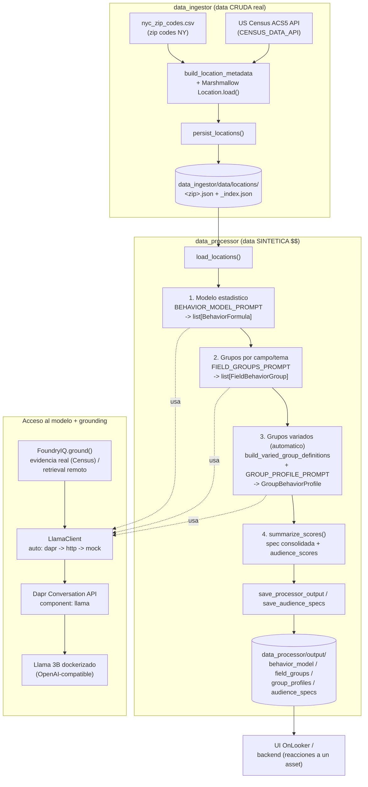
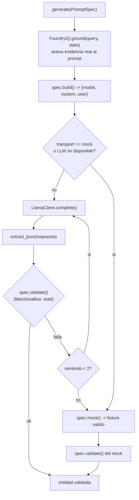
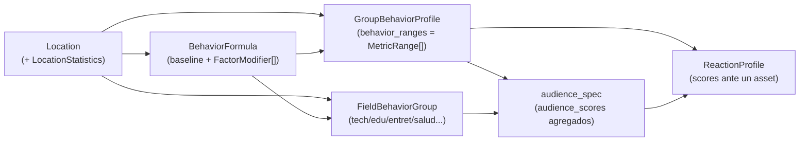

# OnLooker — Workflow del pipeline de audiencia sintetica

Flujo de extremo a extremo: de la data real del Census (NY) a grupos de
audiencia sintetica con scores, anclados en evidencia real (Foundry IQ) y
generados por un Llama 3B dockerizado via Dapr.

## 1. Vista general



## 2. Generacion validada (un PromptSpec)

Cada paso de generacion pasa por el mismo ciclo, con validacion dura contra el
schema y degradacion a mock si no hay modelo.



## 3. Modelo de datos (entidades clave)



## Como correr

```bash
# 1) Data cruda real -> persistida por zip_code
python -m data_ingestor.main                 # requiere CENSUS_DATA_API en .env

# 2) Audiencia sintetica (auto: dapr -> http -> mock)
python -m data_processor

# Camino "Llama via Dapr agents"
dapr run --app-id data-processor \
         --resources-path data_processor/components \
         -- python -m data_processor --transport dapr

# Demo offline (sin modelo)
python -m data_processor --transport mock
```
